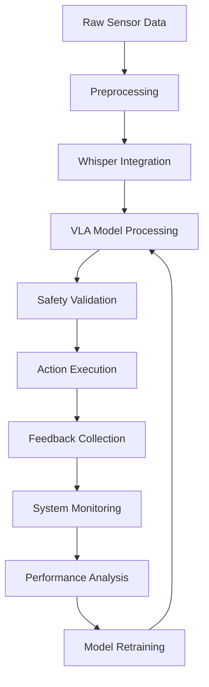

# Autonomous Humanoid Implementation Guide

This chapter provides implementation guidance for creating the complete Autonomous Humanoid system that integrates all the components learned throughout the course. This serves as a practical guide to implement the capstone project described in the previous chapter.

## Overview

The capstone logic brings together the individual components—Whisper voice integration, VLA models, and supporting infrastructure—into a cohesive system that can perceive, understand, and act in real-world environments. This system serves as the foundation for practical embodied intelligence applications.

## System Architecture

```
┌─────────────────────────────────────────────────────────────┐
│                    VLA Capstone System                      │
├─────────────────────────────────────────────────────────────┤
│  Input Layer    │ Processing Layer  │ Output Layer          │
│                │                  │                       │
│  • Cameras     │  • Vision        │  • Robot Actions      │
│  • Microphones │  • Language      │  • Text Responses     │
│  • Sensors     │  • VLA Model     │  • Visual Feedback    │
│  • Network     │  • Reasoning     │  • Audio Responses    │
│                │  • Planning      │                       │
│                │  • Control       │                       │
└─────────────────────────────────────────────────────────────┘
```

## Core Components Integration

### 1. Input Processing Pipeline

The input processing pipeline manages data ingestion from various sensors:

```python
class InputProcessor:
    def __init__(self):
        self.camera_processor = CameraProcessor()
        self.audio_processor = AudioProcessor()
        self.sensor_processor = SensorProcessor()
        
    def collect_multimodal_input(self):
        # Simultaneously collect visual, audio, and sensor data
        visual_data = self.camera_processor.get_frame()
        audio_data = self.audio_processor.get_audio_sample()
        sensor_data = self.sensor_processor.get_sensor_readings()
        
        return {
            'visual': visual_data,
            'audio': audio_data,
            'sensors': sensor_data
        }
```

### 2. Modal Fusion Engine

The fusion engine combines information from different modalities:

```python
class ModalFusionEngine:
    def __init__(self):
        self.visual_encoder = load_vla_visual_encoder()
        self.language_encoder = load_vla_language_encoder()
        self.fusion_network = FusionNetwork()
        
    def fuse_modalities(self, visual_input, language_input, sensor_input):
        # Encode visual information
        visual_features = self.visual_encoder(visual_input)
        
        # Encode language command
        language_features = self.language_encoder(language_input)
        
        # Incorporate sensor data
        fused_features = self.fusion_network(
            visual_features, 
            language_features, 
            sensor_input
        )
        
        return fused_features
```

### 3. Action Generation and Execution

The action generator translates fused representations into robotic commands:

```python
class ActionGenerator:
    def __init__(self):
        self.action_decoder = load_vla_action_decoder()
        self.robot_controller = RobotController()
        
    def generate_and_execute(self, fused_features):
        # Generate action sequence
        action_sequence = self.action_decoder(fused_features)
        
        # Execute actions on robot
        execution_result = self.robot_controller.execute(
            action_sequence
        )
        
        return execution_result
```

## State Management and Planning

### State Representation

```python
class StateManager:
    def __init__(self):
        self.current_state = {}
        self.goal_state = {}
        self.task_history = []
        
    def update_state(self, perception_data):
        # Update internal state based on perception
        self.current_state.update(perception_data)
        
    def plan_sequence(self, goal_description):
        # Plan action sequence to reach goal
        plan = self.generate_plan(
            self.current_state,
            self.parse_goal(goal_description)
        )
        return plan
```

### Hierarchical Planning

- **High-level planning**: Task decomposition and goal setting
- **Mid-level planning**: Subtask sequencing and resource management
- **Low-level planning**: Fine-grained motion and control

## Real-time Execution Framework

### Event-Driven Architecture

```python
class VLAExecutionFramework:
    def __init__(self):
        self.input_processor = InputProcessor()
        self.modal_fusion = ModalFusionEngine()
        self.action_generator = ActionGenerator()
        self.state_manager = StateManager()
        self.event_queue = asyncio.Queue()
        
    async def run_vla_cycle(self):
        while True:
            # Collect inputs
            inputs = await self.input_processor.collect_multimodal_input()
            
            # Process through VLA pipeline
            fused_features = await self.modal_fusion.fuse_modalities(
                inputs['visual'],
                inputs['audio'], 
                inputs['sensors']
            )
            
            # Generate and execute actions
            result = await self.action_generator.generate_and_execute(
                fused_features
            )
            
            # Update state and handle events
            self.state_manager.update_state(result.perception_feedback)
            await self.handle_events(result.events)
            
            await asyncio.sleep(0.01)  # 100Hz control loop
```

## Safety and Validation Layer

### Safety Checks

```python
class SafetyValidator:
    def __init__(self):
        self.collision_predictor = CollisionPredictor()
        self.impact_evaluator = ImpactEvaluator()
        
    def validate_action(self, action, current_state):
        # Check for potential collisions
        collision_risk = self.collision_predictor.predict(
            action, current_state
        )
        
        # Evaluate potential impact of action
        impact_assessment = self.impact_evaluator.evaluate(
            action, current_state
        )
        
        # Return validation result
        return {
            'safe': collision_risk < self.safety_threshold and 
                    impact_assessment < self.impact_threshold,
            'risk_score': max(collision_risk, impact_assessment),
            'suggested_alternatives': []
        }
```

### Fail-Safe Mechanisms

- Emergency stop protocols
- Safe position recovery
- Graceful degradation when components fail
- Redundant sensor validation

## Performance Optimization

### Resource Management

- **GPU allocation**: Dynamic allocation for vision and VLA model inference
- **Memory management**: Efficient caching of model states and precomputed values
- **Computation scheduling**: Prioritizing critical real-time operations

### Latency Reduction Strategies

- Model quantization for faster inference
- Pipeline parallelism for multi-modal processing
- Predictive caching based on recent interactions
- Edge computing deployment

## System Monitoring and Logging

### Real-time Monitoring

```python
class SystemMonitor:
    def __init__(self):
        self.metrics_collector = MetricsCollector()
        self.health_checker = HealthChecker()
        self.log_manager = LogManager()
        
    def monitor_system(self):
        # Collect performance metrics
        metrics = self.metrics_collector.get_current_metrics()
        
        # Check component health
        health_status = self.health_checker.check_all_components()
        
        # Log important events
        self.log_manager.log_system_state(metrics, health_status)
        
        # Trigger alerts if necessary
        self.evaluate_alerts(metrics, health_status)
```

## Deployment Considerations

### Hardware Requirements

- **Computational**: High-performance GPU for real-time inference
- **Sensors**: Cameras, microphones, and tactile sensors
- **Robot**: Actuators and controllers compatible with the system
- **Communication**: Reliable network for remote operations

### Environmental Adaptations

- **Lighting conditions**: Adapting vision processing for different environments
- **Noise levels**: Adjusting audio processing for different acoustic conditions
- **Workspace constraints**: Modifying action generation for physical limitations

## Testing and Validation

### Simulation Testing

- Virtual environments for safe algorithm testing
- Physics-accurate simulations for complex interactions
- Stress testing with edge cases and failure scenarios

### Real-World Validation

- Gradual deployment with human oversight
- A/B testing of different VLA model configurations
- Long-term reliability studies

## Example Complete Integration

```python
class CompleteVLASystem:
    def __init__(self):
        # Initialize all VLA components
        self.input_processor = InputProcessor()
        self.whisper_integration = WhisperVoiceIntegration()
        self.vla_model = load_pretrained_vla_model()
        self.action_executor = ActionExecutor()
        self.safety_validator = SafetyValidator()
        self.system_monitor = SystemMonitor()
        
    def execute_command(self, audio_command, visual_context):
        try:
            # Step 1: Process voice command
            text_command = self.whisper_integration.process_voice_command(
                audio_command
            )
            
            # Step 2: Fuse visual and language inputs
            fused_representation = self.vla_model.encode(
                visual_context, 
                text_command
            )
            
            # Step 3: Generate action sequence
            action_sequence = self.vla_model.decode(fused_representation)
            
            # Step 4: Validate safety
            safety_check = self.safety_validator.validate_action(
                action_sequence, 
                visual_context
            )
            
            if not safety_check['safe']:
                raise SafetyException(
                    f"Action unsafe: {safety_check['risk_score']}"
                )
            
            # Step 5: Execute action
            execution_result = self.action_executor.execute(
                action_sequence
            )
            
            # Step 6: Monitor and log
            self.system_monitor.monitor_system()
            
            return execution_result
            
        except Exception as e:
            # Handle errors and return to safe state
            self.action_executor.emergency_stop()
            raise e
```

## Evaluation and Improvement

### Performance Metrics

- **Task Success Rate**: Percentage of tasks completed successfully
- **Response Time**: Latency from command to action initiation
- **Accuracy**: Precision of executed actions compared to intended
- **Safety Incidents**: Number of safety-related interventions

### Continuous Improvement

- Regular model retraining with new interaction data
- User feedback integration for experience enhancement
- A/B testing of new features and algorithms
- Systematic error analysis and correction

## Deployment Pipeline



## Conclusion

The capstone logic represents the culmination of all VLA components into a functional embodied intelligence system. Success depends on careful integration of each component, robust safety mechanisms, and continuous monitoring and improvement. The system must be designed to handle real-world complexity while maintaining safety and reliability.

This complete implementation provides a foundation for building sophisticated robotic applications that can understand natural language commands, perceive their environment, and execute appropriate actions in response.